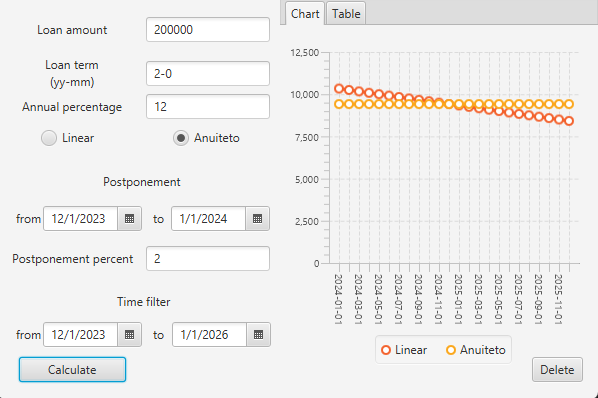
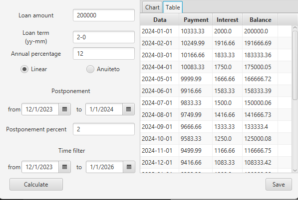
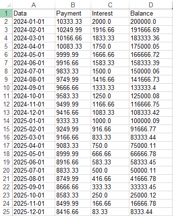

# Mortgage Calculator

This is a ***Mortgage Calculator*** made using *JavaFX*. It was created during an Object-Oriented Programming course during the second semester of **Software Engineering (2023)**.

## It includes the following features:
 * Annuity and linear mortgage calculations;
 * Payment postponement featuring custom postponement interest;
 * Payment representation in a table;
 * Payment representation in a graph;
 * Ability to view payments of selected time frame;
 * Data exportation to and representation in an excel spreadsheet.

 ## Examples:
  
*Main screen featuring graph*  

  
*Main screen featuring table*  

  
*Main screen featuring excel spreadsheet*  

